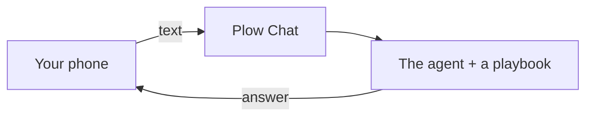
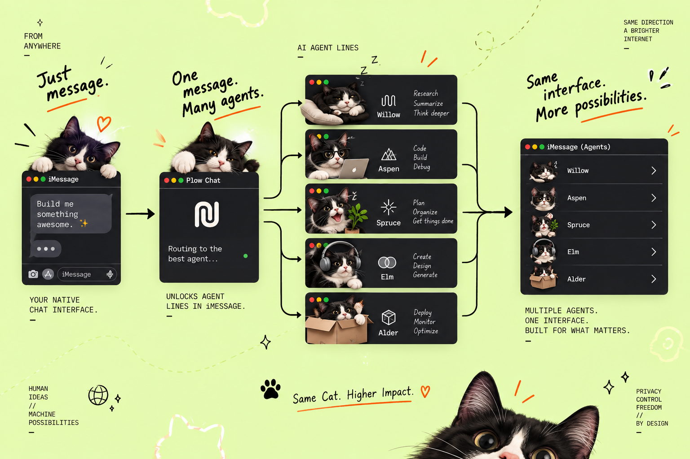

<p align="center">
  
</p>

<h1 align="center">Cat Paw 🐾</h1>

<p align="center">
  <strong>Build. Ship. Repeat.</strong>
</p>

<p align="center">
  Text the cat. It picks a playbook and does the job.
</p>

<p align="center">
  <a href="LICENSE"></a>
</p>

<p align="center">
  <a href="#two-runtimes-one-cat">Two runtimes</a>
  ·
  <a href="#how-it-works">How it works</a>
  ·
  <a href="#the-line">The line</a>
  ·
  <a href="#text-it-like-this">Text it like this</a>
  ·
  <a href="#what-the-cat-knows">What the cat knows</a>
  ·
  <a href="#install">Install</a>
</p>

We build tools for people who build things.

Sometimes the cat breaks production. Usually the cat fixes it too. 🐾

---

## Two runtimes, one cat

Cat Paw ships as **two images of the same product**. The playbooks, the
persona, the phone line and the approval path are identical; the agent runtime
underneath is not. Pick the one that matches what you already run — there is
no feature difference and no "better" one.

| | [openclaw-cat-paw](https://github.com/kumanaya/openclaw-cat-paw) | [hermes-cat-paw](https://github.com/kumanaya/hermes-cat-paw) |
| --- | --- | --- |
| Runtime | [OpenClaw](https://docs.openclaw.ai) | Hermes |
| Plow base | `plow-cloud-agents:base-d78e4ea7` | `plow-cloud-agents:base-67021a70` |
| State directory | `/var/lib/plow`, as `node` | `/var/lib/hermes`, as `hermes` |
| Model | `plow/z-ai/glm-5.2`, then `plow/anthropic/claude-sonnet-5` | `openai/gpt-5.6-luna` |
| Agent Index | [openclaw-cat-paw](https://aiworthusing.com/agent-index/openclaw-cat-paw) | [hermes-cat-paw](https://aiworthusing.com/agent-index/hermes-cat-paw) |
| Pick it if | you want a maintained runtime, or you have never run one | you already have a Hermes home, persona and sessions you want to keep |

Both are in this repository pair, and the two READMEs are kept identical on
purpose: the product you are reading about is the same one, and the only thing
that picks a repo is the runtime you already have.

**If you are not sure:** take the left one. It is the newer base and the
better-maintained runtime, and `scripts/install-skills.sh --home` adds the cat
to an existing installation of the other without touching it.

### The playbooks are shared

The 51 playbooks that do not know what runtime they are in live in
**[cat-paw-workflows](https://github.com/kumanaya/cat-paw-workflows)**. Both
images clone it at `docker build`, at the commit pinned in
`vendor/cat-paw-workflows.pin` — pinned by SHA, not by tag, for the same
reason the base image is. A fix to a playbook lands in both agents at once,
which is why that repository verifies itself and fails on any text that names
a runtime.

Five skills stay in each agent, because they are statements about *that*
machine: the boot, the state directory, how a reply is delivered, what is
baked in the image. The same text would be false in the other runtime.

---

## How it works

You text. The cat texts back.

| Piece | What it is |
| --- | --- |
| **Plow Chat** | The phone line. |
| **The runtime** | The brain. It opens one playbook and follows it. |



No desktop app required. The playbooks are the job.

---

## The line

You text from the phone you already have. Plow Chat is that conversation. iMessage in, the cat out.

A line is a named slot on your Plow account: Willow, Aspen, Spruce, Elm, Alder. The installer takes one that's free. The name in the [dashboard](https://app.plow.co/dashboard) is the same number you text.

One message can reach more than one agent. Same chat. A different line.

<p align="center">
  
</p>

---

## Text it like this

Talk like you would at 2am. The cat answers the same way.

```text
You: Spec this before anyone writes code. The signup
     drop-off is the actual bug.

Cat Paw: Opening to-spec. I'll stop at the spec.
        Implementation waits until you say build.

You: Draft the cold email for the three design partners.
     Don't send it.

Cat Paw: prospecting, then cold-email. Draft only.
        Nothing leaves until you say so.

You: The renewal for Northwind looks bad. What do I
     actually know?

Cat Paw: health-read, then renewal-risk. I'll label
        what I read and what I haven't.

You: Review PR 12. Don't run the fork.

Cat Paw: change-review. Read-only until you say the
        tests may run untrusted code.
```

A normal turn:

1. Say the job.
2. The cat opens **one** playbook. It does not invent the procedure.
3. You get the result in the thread.

---

## What the cat knows

The agent does not freelance a process. It opens a playbook and works that objective.

| Pack | When you text about… | License |
| --- | --- | --- |
| [Engineering](https://github.com/mattpocock/skills) | Specs, bugs, TDD, review, CI, QA | MIT |
| [Product](https://github.com/phuryn/pm-skills) | Discovery, a PRD, a roadmap | MIT |
| [Marketing](https://github.com/coreyhaines31/marketingskills) | Copy, SEO, launch, ads, social, community, content | MIT |
| Sales | A cold email, a prospect list, a POC | MIT |
| [Customer success](https://github.com/CSPulse/customer-success-skills) | Health, renewal, a QBR, churn | MIT |
| Finance | Runway, metrics, a CFO read. Not a trading desk | MIT |
| [Design](https://github.com/emilkowalski/skills) | Motion, UI, accessibility | MIT |
| Documents | A PDF, docx, pptx, or xlsx you can open | MIT |
| [Academic research](https://github.com/Imbad0202/academic-research-skills) | A paper, a citation check | CC BY-NC 4.0. Not MIT |
| Security | Authorized recon, a hunt, a report. One pack among the others | Apache-2.0 |

Local adapted routers and their child playbooks are baked into the image from
`cat-paw-workflows`, so they load with no install step. External playbooks are
pinned by commit and cloned at install, into a directory on the state volume
so they survive an image rebuild. The `skill-packs` router is the map, and it
is in the agent's prompt.

Care with the security pack. Probe a target you own, or one you have in writing. Without that, no probe.

Not installed, on purpose:

- `slavingia/skills` has no license.
- Anthropic's `pdf` / `docx` / `pptx` / `xlsx` skills are source-available, not open source.
- RH, recruiting, legal, investor relations, and office-manager playbooks we found cannot be redistributed here.

The image stays small. `gitleaks`, `gh`, `jq`, `yq`, `shellcheck` are in it (`vendor/review-tools.pin`).

### Local adapted sources

Canonical in [cat-paw-workflows](https://github.com/kumanaya/cat-paw-workflows#adapted-sources),
which is where those playbooks now live. Reproduced here so the licence and
scope caveats travel with the product page.

| Source repo | Audited commit | License and scope caveat |
| --- | --- | --- |
| `obra/superpowers` | `5bf4e78011075bcfc0dc295f0724994cd123ee71` | MIT; local concepts only, no upstream prose or automatic bootstrap/worktree workflow |
| `DietrichGebert/ponytail` | `e3ba2aa6f1e6f0bc4d69eb09c9f0d0a93af56156` | MIT; local necessity, removal, and debt procedures with safety and rollback preserved |
| `JuliusBrussee/caveman` | `2fd153c67988e980fb0b2455c90832159a6a5a25` | MIT skill concepts only; no BSL runtime, proxy, gateway, or telemetry |
| `ayghri/i-have-adhd` | `839872f9d1cd634fed642b4589ce7226199cc15f` | MIT; renamed opt-in style, not a diagnosis or medical claim |
| `Graphify-Labs/graphify` | `4c735618f3d56fd622c2049771584621c31ba9ff` | Apache-2.0; local graph guidance, no third-party assets or remote LLM ingest |
| `Egonex-AI/Understand-Anything` | `6df3065f1d8ddc2ce3615314d1d493f36d6b1c80` | MIT; local knowledge procedures, no mutable installer or unverified viewer claim |
| `mvanhorn/last30days-skill` | `084662b501fb0dba95bd55eff0c258d35e0dc499` | MIT; source-transparent public research, no cookies, paid APIs, hosted mode, or publishing |
| `sickn33/agentic-awesome-skills` | `7b534bc15d833baf3bc98b3ca4fb23eda48342bb` | Root MIT; docs CC-BY-4.0; imported skills retain their own licenses; no bulk import |
| `K-Dense-AI/scientific-agent-skills` | `49c6e97775eaa18ba791bebe23162a70ae601c18` | Root MIT with per-skill exceptions; no clinical decisions, lab/cloud mutation, or hidden credentials |
| `cathrynlavery/diagram-design` | `dc1ace47b99a419e42d01a03cb6ace5346efa8ae` | MIT skill; no bundled third-party assets; self-contained accessible HTML/SVG scope |

These are local Cat Paw adaptations. They are not upstream clones; the commit
and license notes are audit and scope context, not a promise that an external
source is bundled.

<details>
<summary><strong>Load or reload the packs</strong></summary>

```sh
# the repo you are in — pick the runtime you already run
git clone https://github.com/kumanaya/openclaw-cat-paw.git
# or
git clone https://github.com/kumanaya/hermes-cat-paw.git

cd openclaw-cat-paw     # or: cd hermes-cat-paw

./scripts/install-skills.sh                            # the Compose agent
# ./scripts/install-skills.sh --home ~/.openclaw        # an existing OpenClaw home
# ./scripts/install-skills.sh --home ~/.hermes          # an existing Hermes home
```

Windows: `scripts/install-skills.ps1`.

</details>

---

## A stop, if you want one

The cat ships without a desktop app. If you want a pause before an action hits your machine, that project is [Cat Paw Latch](https://github.com/kumanaya/cat-paw-latch). You see the command. You tap yes or no.

<p align="center">
  
</p>

That is optional. The agent works from the text thread either way.

---

## The cat stops

A few things it will not smooth over.

- No playbook for the job → it says so. It does not improvise a procedure.
- A security target without written scope → no probe.

---

## Install

Full guide: **[docs/INSTALL.md](docs/INSTALL.md)** in whichever repo you cloned.

| I want | What I get |
| --- | --- |
| [**The agent**](docs/INSTALL.md#agent-only) | Text the cat from my phone. |
| [**Latch**](docs/INSTALL.md#latch-only) | Approve actions on this computer. |
| [**Both**](docs/INSTALL.md#both) | The phone line, plus yes/no on this computer. |
| [**I already run the runtime**](docs/INSTALL.md) | Keep it. Add the cat. The section is named for your runtime. |

```sh
git clone https://github.com/kumanaya/openclaw-cat-paw.git   # or hermes-cat-paw
cd openclaw-cat-paw
./scripts/install.sh
```

Windows: `Set-ExecutionPolicy -Scope Process Bypass` then `.\scripts\install.ps1`.

Push button. Ship software. Acquire treats. 🐾

---

<p align="center">
  <strong>Cat Paw 🐾 — Build. Ship. Repeat.</strong>
</p>

<p align="center">
  MIT · <a href="LICENSE">LICENSE</a>
  · external playbooks keep their upstream license; local adaptations are listed above
  · playbooks shared with <a href="https://github.com/kumanaya/hermes-cat-paw">hermes-cat-paw</a> and
  <a href="https://github.com/kumanaya/openclaw-cat-paw">openclaw-cat-paw</a> via
  <a href="https://github.com/kumanaya/cat-paw-workflows">cat-paw-workflows</a>
</p>
