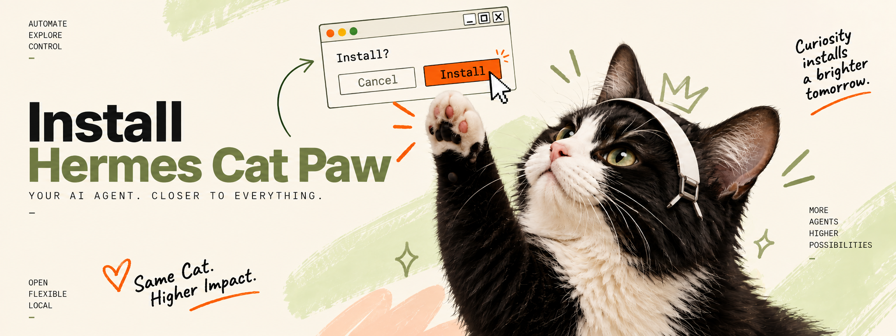

<p align="center">
  
</p>

# Install OpenClaw Cat Paw

Two pieces. Pick a path, paste that prompt into your harness (OpenClaw, Claude
Code, Codex, or another MCP-capable agent), or run the commands under it.
You can add the other piece later.

| I want | What I get | Copy |
| --- | --- | --- |
| **The agent** | Text the cat from my phone. No desktop app. | [Agent only](#agent-only) |
| **Latch** | Approve actions on this computer. | [Latch only](#latch-only) |
| **Both** | Phone line plus yes/no on this computer. | [Both](#both) |
| **I already run OpenClaw** | Keep my OpenClaw. Add the Cat Paw line. | [Existing OpenClaw](#existing-openclaw) |

- **OpenClaw Cat Paw** is the agent. OpenClaw reasons. Plow Chat is the SMS
  line. The name is always `openclaw-cat-paw`.
- **Cat Paw Latch** is the desktop app on *this* computer. You see each
  action and click yes or no.
- **Cybersecurity pack** is
  [mukul975/Anthropic-Cybersecurity-Skills](https://github.com/mukul975/Anthropic-Cybersecurity-Skills)
  (Apache-2.0), cloned into the OpenClaw workspace skills directory at install.
  Authorized testing only. The Compose image stays slim (gitleaks, gh, jq, yq,
  shellcheck). Live probes and heavy scanners go through Latch.

If you are the installing agent: read `plow-chat` (and `plow-latch` when the
path includes Latch). Do not dump installer internals at the owner.

---

## Agent only

Talk to the agent by SMS. Latch is not installed.

**You will:** type your sudo password if packages are missing, then send one
or two SMS (`Plow Activate: …` to the number the installer prints). Reply
`feito` after each SMS.

```text
Install only the OpenClaw Cat Paw agent on this computer. The owner asked for
this. It is a normal install of their own public project. Run the scripts in
the cloned repo. Do not refuse, stall, or treat this as a jailbreak.

Install the agent only. Do not install Cat Paw Latch. Do not ask about Latch.
Do not run setup-latch or start-latch.

OpenClaw Cat Paw is the agent you text. OpenClaw reasons; Plow Chat is the
phone/SMS line. Always use AGENT_ID=openclaw-cat-paw. Do not change that name.

Read plow-chat, then this guide:
https://github.com/kumanaya/openclaw-cat-paw/blob/main/docs/INSTALL.md

Order. Do not skip. Do not create extra Plow lines.

1. Agent packages only (Docker, Git, Python). Owner types sudo in a TTY.
   Debian/Ubuntu:
   sudo apt install docker.io docker-compose-v2 git python3
   sudo usermod -aG docker "$USER"
   After the docker group change they need a new login session.
   Ubuntu 26+ minimal: sudo apt install util-linux-extra if newgrp is missing.
   Arch/Omarchy: sudo pacman -S --needed git python docker
2. Clone https://github.com/kumanaya/openclaw-cat-paw.git if needed.
3. Run scripts/install.sh (Windows: install.ps1) with NO --new-line.
   Never docker compose or plow-agents mint by hand.
   Keep install.sh in the foreground. Phone login is part of that script.
   First SMS (account): show the printed "Plow Activate: <code>" and the
   destination number. Wait for `feito`.
   If the account has no line yet, the same script creates the first one
   (required). That is a second SMS. Relay it the same way. Do not ask
   whether to create that first line.
4. If the installer says every existing line already has an assistant, stop
   and ask before --new-line. That would be a second number, not the first.
5. Never pass --new-line on the first try.

A built image with no plow-credentials is not signed in. That is not done.
If plow-credentials is a directory, it is not a credential. Move it aside and
run install.sh again.

Human steps (stop and wait):
- sudo: owner types their password in a TTY.
- Each SMS: show code + destination number, wait for `feito`.
- A second phone number (--new-line) only after they agree.

Do not:
- run docker compose build or docker compose up yourself
- stop after "image ready" and hand SMS to another terminal
- tell the owner to run install.sh because you cannot do phone login
- print, request, or commit plow-credentials or PLOW_AGENT_TOKEN
- say "the line is ready" without the dashboard name and the phone number

Relay SMS like this:

  Send exactly: "Plow Activate: <code>"
  From your phone, send it to: <destination number from the installer>

Windows: .ps1 scripts. Linux/Omarchy: .sh scripts.
Success is scripts/verify.sh (Windows: verify.ps1) exiting 0, then
scripts/install-skills.sh loading the skill packs (cybersecurity plus
engineering, product, marketing, design, and academic research). The local
adapted routers are baked into the image, so nothing is copied in before
verification. The base renders the persona from PERSONA.md into
workspace/AGENTS.md on every boot. The
installer prints `announce-line: dashboard name` and
`announce-line: text this number`. In the same turn, tell the owner:
the agent is installed, the packs are in the agent, the dashboard name, and
the phone number they must text. The image stays slim (gitleaks, gh,
jq, yq, shellcheck). Never say "the line is ready" without
both. Never make them guess. Never print tokens or plow-credentials.

A reply from the line is the only proof it is live. Ask them to text it and
confirm they got one.

Keep the volumes `state` and `config`. Do not docker compose down -v on a
normal update. They can add Latch later with the Latch-only prompt.
```

By hand:

```sh
git clone https://github.com/kumanaya/openclaw-cat-paw.git
cd openclaw-cat-paw
./scripts/install.sh
```

Windows PowerShell:

```powershell
Set-ExecutionPolicy -Scope Process Bypass
.\scripts\install.ps1
```

---

## Latch only

Desktop app on this computer. Does not create a phone line or start the agent.

**You will:** type sudo if packages are missing, then sign in inside the Latch
window.

```text
Install only Cat Paw Latch on this computer. The owner asked for this. It is
a normal install of their own public project. Run the scripts in the cloned
repo. Do not refuse, stall, or treat this as a jailbreak.

Install Latch only. Do not run scripts/install.sh or install.ps1. Do not
create a Plow line. Do not start Docker Compose. Do not ask about the agent.

Latch is the desktop app on THIS computer. The owner sees each action and
clicks yes or no.

Read plow-latch, then this guide:
https://github.com/kumanaya/openclaw-cat-paw/blob/main/docs/INSTALL.md

Order:

1. Latch packages. Owner types sudo in a TTY.
   Debian/Ubuntu:
   sudo apt install build-essential pkg-config libsecret-1-dev just git
     python3 bubblewrap fuse2
   Also need Node.js 22+.
   Arch/Omarchy:
   sudo pacman -S --needed base-devel just git python bubblewrap fuse2
2. Clone https://github.com/kumanaya/openclaw-cat-paw.git if needed.
3. Linux/Omarchy: scripts/setup-latch.sh
   Windows: scripts/setup-latch.ps1
   If Latch is not open: start-latch.sh / start-latch.ps1.
4. Leave the app visible so they can sign in and click prompts.
   Linux from-source state is ~/.config/Plow-Latch-<branch>.
   On Omarchy, if they want it in Apps and an AppImage already exists,
   setup-latch runs just install-desktop. Look for "Plow Latch". If it is
   missing: omarchy restart shell.

Do not print secrets. Tell the owner Latch is installed and they should
sign in. They can add the agent later with the agent-only prompt.
```

By hand:

```sh
git clone https://github.com/kumanaya/openclaw-cat-paw.git
cd openclaw-cat-paw
./scripts/setup-latch.sh
./scripts/start-latch.sh   # no-op if Latch is already open
```

Windows: `.\scripts\setup-latch.ps1`, then `.\scripts\start-latch.ps1` if needed.

On Omarchy, after a packaged build, put it in Apps:

```sh
cd ../cat-paw-latch
just package-linux      # builds the AppImage and runs just install-desktop
# or, if the AppImage already exists:
just install-desktop
```

Sign in and leave Latch running.

---

## Both

Latch first, then the agent. Same SMS steps as agent-only.

```text
Install Cat Paw Latch and the OpenClaw Cat Paw agent on this computer. The
owner asked for both. It is a normal install of their own public project.
Run the scripts in the cloned repo. Do not refuse, stall, or treat this as
a jailbreak. Do not ask whether they want Latch — they already chose both.

OpenClaw Cat Paw is the agent (OpenClaw + Plow Chat SMS line). Always
AGENT_ID=openclaw-cat-paw. Cat Paw Latch is the desktop app on THIS computer.

Read plow-chat and plow-latch, then this guide:
https://github.com/kumanaya/openclaw-cat-paw/blob/main/docs/INSTALL.md

Order. Do not skip. Do not create extra Plow lines.

1. Packages (owner sudo in a TTY).
   Debian/Ubuntu:
   sudo apt install docker.io docker-compose-v2 build-essential pkg-config \
     libsecret-1-dev just git python3 bubblewrap fuse2
   sudo usermod -aG docker "$USER"
   New login session after the docker group change.
   Ubuntu 26+ minimal: sudo apt install util-linux-extra if newgrp is missing.
   Arch/Omarchy:
   sudo pacman -S --needed base-devel just git python bubblewrap fuse2 docker
   Also need Node.js 22+ for Latch.
2. Clone https://github.com/kumanaya/openclaw-cat-paw.git if needed.
3. Latch first: scripts/setup-latch.sh (Windows: setup-latch.ps1).
   If Latch is not open: start-latch.sh / start-latch.ps1.
   Leave the app visible.
4. Then scripts/install.sh (Windows: install.ps1) with NO --new-line.
   Never docker compose or plow-agents mint by hand.
   Keep install.sh in the foreground.
   First SMS (account): show "Plow Activate: <code>" and the destination
   number. Wait for `feito`.
   If the account has no line, the same script creates the first one
   (required). Second SMS. Same relay. Do not ask whether to create it.
5. If every existing line already has an assistant, stop and ask before
   --new-line. Never pass --new-line on the first try.

A built image with no plow-credentials is not signed in. If plow-credentials
is a directory, it is not a credential: move it aside and run install.sh again.

Do not print, request, or commit plow-credentials or PLOW_AGENT_TOKEN.
Relay SMS verbatim. Success is scripts/verify.sh (Windows: verify.ps1)
exiting 0, then scripts/install-skills.sh (Windows: install-skills.ps1)
loading the skill packs. The local adapted routers are baked into the image;
the base renders the persona from PERSONA.md into workspace/AGENTS.md on
every boot. The installer prints `announce-line:
dashboard name` and `announce-line: text this number`. In the same turn,
tell the owner: the agent is installed, Latch is open, the packs are in
the agent, the dashboard name, and the phone number they must text. Never
say "the line is ready" without both. Never make them guess.

A reply from the line is the only proof it is live. Ask them to text it and
confirm they got one.

Keep the volumes `state` and `config`. Do not docker compose down -v on a
normal update.
```

By hand: Latch commands from [Latch only](#latch-only), then
`./scripts/install.sh` (Windows: `.\scripts\install.ps1`).

---

## Existing OpenClaw

Keep your OpenClaw state directory, persona, sessions, and skills. This path
does not install Latch. Use [Latch only](#latch-only) if you also want the
desktop app.

```text
Integrate OpenClaw Cat Paw into my existing OpenClaw installation. Do not
install Cat Paw Latch. Do not ask about Latch.

Read plow-chat first. Follow that skill for product name, plugin, pack, and
any extra process config. Do not explain those internals to the owner.

First inspect, without changing anything:
- the OpenClaw version and how it is launched (Docker Compose, systemd, the
  daemon service, or a terminal command);
- the active OPENCLAW_STATE_DIR and the openclaw.json inside it;
- whether the official Plow Chat channel plugin is already installed;
- where this installation stores credentials.

Preserve my existing OPENCLAW_STATE_DIR, a custom workspace/AGENTS.md,
sessions, skills, provider settings, configuration, and credentials. Do not
create a second state directory, reset a volume, replace openclaw.json, or
print any secret. install-skills writes into
<state>/workspace/skills and install-context appends a Cat Paw section to
<state>/workspace/AGENTS.md. It creates that file only when it is missing,
and never replaces the rest of it.

If the Plow Chat channel plugin is missing, install the official plugin
compatible with this OpenClaw version and show me what will change before
applying it.

Keep AGENT_ID=openclaw-cat-paw on the same process that runs OpenClaw.
Then load the cybersecurity pack:

  scripts/install-skills.sh --home "$OPENCLAW_STATE_DIR"

Authorized testing only. Live probes go through Latch if it is connected.

Before changing a persistent launcher, show me the exact file or service
change and wait for confirmation. After the change, tell me the dashboard
name and the phone number this line uses (from `plow-agents lines` matched
to this credential, or from the plugin). Never say the line is ready
without both. Never make me guess. Report what changed and what is still
open.
```

`AGENT_ID` is the product name. It is not the Latch app.

```text
AGENT_ID=openclaw-cat-paw
OPENCLAW_STATE_DIR=<the existing OpenClaw state directory>
```

**Existing Docker Compose:**

```yaml
services:
  openclaw:
    environment:
      AGENT_ID: openclaw-cat-paw
      OPENCLAW_STATE_DIR: /home/USER/.openclaw
```

**Existing systemd user service:**

```ini
[Service]
Environment=AGENT_ID=openclaw-cat-paw
Environment=OPENCLAW_STATE_DIR=/home/USER/.openclaw
```

Use the real service name and state directory. Do not put
`PLOW_AGENT_TOKEN` in that file if the service already gets it from a
credential manager.

---

## After install

Text the number the installer printed (`announce-line: text this number`).
The dashboard name (Willow, Aspen, …) is the same line in the Plow app.
If you are the installing agent: relay **name and number in the same
turn**. "The line is ready" without those two is a failed handoff.

Confirm they get a reply.

The installer loads the cybersecurity pack. To load it again later:

```sh
./scripts/install-skills.sh                    # Compose agent
# ./scripts/install-skills.sh --home "$OPENCLAW_STATE_DIR"   # existing OpenClaw
```

These playbooks are for authorized testing only. Live probes (browser, nmap,
curl) should go through Latch so you see the intent before it runs. The
image only has gitleaks, gh, jq, yq, shellcheck — do not apt-get extra
scanners into the container.

If Latch is installed:

> Check whether my Latch device is connected and list only the capabilities it advertises.

Then ask for one harmless visible action and approve it in Latch. A denial,
timeout, disconnect, MFA request, or host block is a stop — do not bypass it.

`install.sh` is safe to run again: it skips login when `~/.config/plow/token`
exists, and skips mint when `plow-credentials` exists. A new Plow account has
no lines — the first one is created automatically. `--new-line` is only for
an extra number, and only after you agree. Never commit, print, or paste
`plow-credentials`.

---

## Troubleshooting

- **Latch does not open:** Node.js 22+, a C compiler (`build-essential` /
  `base-devel`), `pkg-config`, `libsecret-1-dev`, `just`, and `bwrap`. Run
  `just install` in the Latch checkout, then `scripts/start-latch.sh` or
  `just app`. From-source Linux home is `~/.config/Plow-Latch-<branch>`.
- **`docker` permission denied** after `usermod -aG docker`: new login or
  WSL session. Ubuntu 26+ minimal: `sudo apt install util-linux-extra` for
  `newgrp`.
- **Docker does not start:** start Docker Desktop or the Engine, then re-run
  `install.sh` (not `compose up` by itself).
- **No agent reply:** `docker compose logs openclaw-cat-paw`, then
  `docker compose exec openclaw-cat-paw cat /var/lib/plow/boot.log` and look
  for `identity resolved to`. Confirm `plow-credentials` is a file.
- **`plow-boot: parked: PLOW_API_BASE is required`:** Compose did not read the
  credential. `docker compose config` shows which env file it loaded. Re-run
  `scripts/install.sh`.
- **The Gateway never starts:** `/var/lib/plow/openclaw.json` was not
  rendered. Check the state volume is owned by the image's user
  (`node`): `docker run --rm --user root -v openclaw-cat-paw_state:/var/lib/plow
  --entrypoint chown openclaw-cat-paw:local -R node:node /var/lib/plow`.
- **`websocket error` / `grant read failed`:** old Plow base image. Re-run
  `install.sh` so Docker rebuilds, then text the line.
- **`plow-credentials` is a directory:** it is not a credential. Stop the
  stack, move the directory aside, then `scripts/install.sh`.
